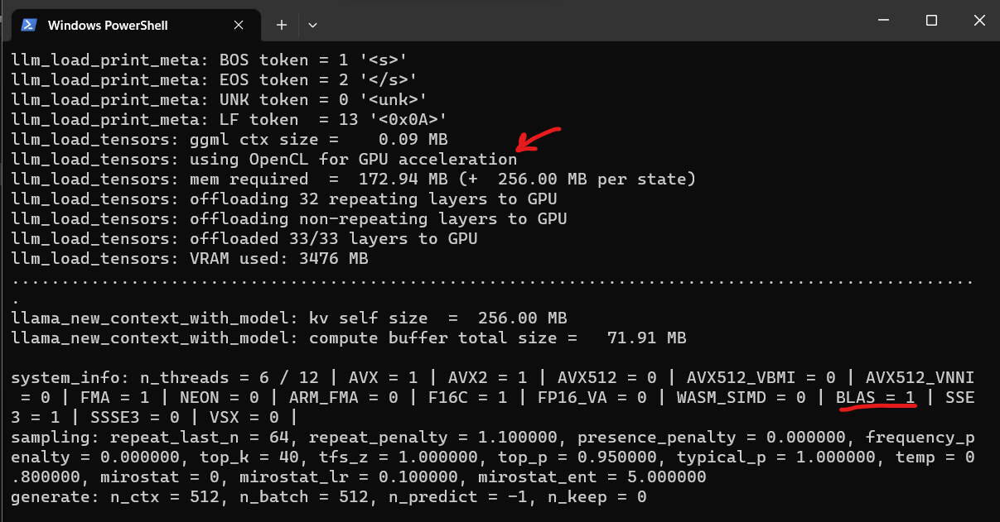

# Compilation of `llama-cpp-python` and `llama.cpp` with CLBlast

A simple guide to compile Llama.cpp and llama-cpp-python using CLBlast for older generation AMD GPUs (the ones that don't support ROCm, like RX 5500).

# Installation of llama-cpp-python with CLBlast
1. Install `cmake` using pip.
```
pip install cmake
```


2. Follow regular instructions to install llama-cpp-python. The uninstalled the default llama-cpp-python versions installed:
```
pip uninstall -y llama-cpp-python llama-cpp-python-cuda
```


3. Move the `OpenCL` folder under the C drive. Alternatively, edit the `CLBlastConfig-release.cmake` file to point to where you save the folder `OpenCL`. 
    * This folder was obtained from [OCL SDK Light AMD](https://github.com/GPUOpen-LibrariesAndSDKs/OCL-SDK). The only difference is that that one creates an env variable to OCL_ROOT, but you can just point to the folder directly and avoid dealing with .exe files.
    * Here is the part you need to update in the `CLBlastConfig-release.cmake` file if you save the `OpenCL` folder somewhere else:
    ```
    # Import target "clblast" for configuration "Release"
    set_property(TARGET clblast APPEND PROPERTY IMPORTED_CONFIGURATIONS RELEASE)
    set_target_properties(clblast PROPERTIES
        IMPORTED_IMPLIB_RELEASE "${_IMPORT_PREFIX}/lib/clblast.lib"
        IMPORTED_LINK_INTERFACE_LIBRARIES_RELEASE "C:/OpenCL/lib/OpenCL.lib"
        IMPORTED_LOCATION_RELEASE "${_IMPORT_PREFIX}/lib/clblast.dll"
    )
    ```
    Edit the `IMPORTED_LINK_INTERFACE_LIBRARIES_RELEASE` to where you put OpenCL folder.

4. Reinstall llama-cpp-python using the following flags.The location `C:/CLBlast` should be where you downloaded the folder CLBlast from this repo (you can put it anywhere, just make sure you pass it to the *-DCLBlast_DIR flag*)

    * For powershell, set env variables first:
    ```
    $env:CMAKE_ARGS="-DLLAMA_CLBLAST=on -DCLBlast_DIR=C:/CLBlast"
    $env:FORCE_CMAKE=1 
    pip install llama-cpp-python --no-cache-dir
    ```

    * If you are installing through cmd, you can just use this instead:
    ```
    CMAKE_ARGS="-DLLAMA_CLBLAST=on -DCLBlast_DIR=C:/CLBlast" FORCE_CMAKE=1 pip install llama-cpp-python --no-cache-dir
    ```


5. All done, fire it up and you should see something like this when you load a model using llama-cpp-python:
<!-- Display image from Screenshots folder -->



# Installation of `llama.cpp` with CLBlast
1. Install `cmake` using pip.
```
pip install cmake
```
2. Clone `llama.cpp` repo
```
git clone https://github.com/ggerganov/llama.cpp
cd llama.cpp
```
3. Create a build folder and run cmake with the following flags:
* `-DLLAMA_CLBLAST=on` to enable CLBlast
* `-DCLBlast_DIR=C:/CLBlast` to point to where you downloaded the folder CLBlast from this repo (you can put it anywhere, just make sure you pass it to the *-DCLBlast_DIR flag*)
```
mkdir build
cd build
cmake .. -DLLAMA_CLBLAST=on -DCLBlast_DIR=C:/CLBlast
```

4. Build the project
```
cmake --build . --config Release
```

5. Add the  the `clblast.dll` folder to your path. Or alternatively. Just copy the `clblast.dll` to the `Release` folder where you have your llama-cpp executables.
    * You can find the `clblast.dll` in `C:\CLBlast\lib` on this repo.

6. Run a model
```
cd bin/Release
.\main.exe -m 'C:\YOUR-MODELS-FOLDER\codellama-7b-instruct.Q5_K_S.gguf' -ngl 40 -t 6 -p 'write a python function to delete all folders that are bigger than 100 mb on current directory'
```
where the flags mean:
* `-m` path to the model
* `-ngl` number of layers to offload to gpu
* `-t` number of threads
* `./main.exe` is the executable generated by cmake

# Common errors and solutions

**Error**: 
```
Error The code execution cannot proceed because clblast.dll was not found
```
**Solution**: Put `clblast.dll` in the same folder as the executables. You can find the `clblast.dll` in `C:\CLBlast\lib` on this repo. Or add the folder where you have the `clblast.dll` to your path.

-----------------
**Error**: 
```
CMake Error in CMakeLists.txt:
  Imported target "clblast" includes non-existent path

    "C:/OpenCL/include"
```
**Solution**
Edit the `CLBlastConfig-release.cmake` file to point to where you saved the folder `OpenCL` if it is different from `C:\OpenCL`.

